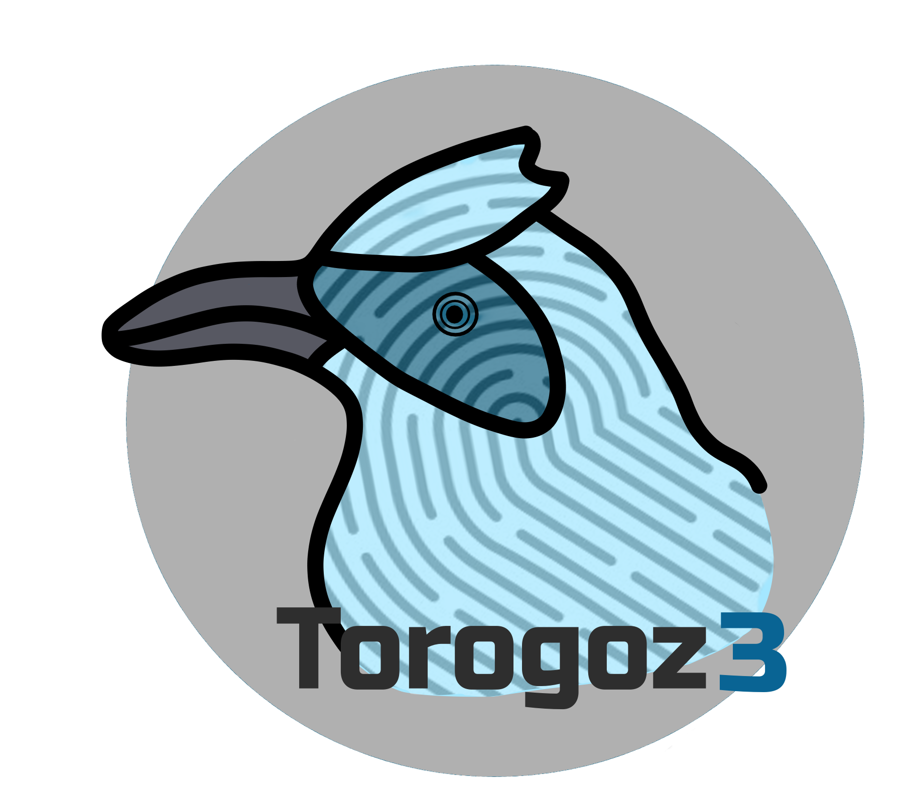

## Torogoz 3



       

# Torogoz3

A secure, scalable, and modern authentication system designed for blockchain and Web3-based projects.

## Key Features

- Secure authentication implementation.
- Integration with blockchain technologies, leveraging Ethereum Attestation Service (EAS) for creating secure and immutable attestations on the Ethereum network.
- Compatible with traditional systems and dApps.

---

## Table of Contents

1. [Description](#description)  
2. [Contributions](#contributions)  
3. [License](#license)  
4. [Contact](#contact)  

---

## Description

Torogoz3 is a decentralized identity DApp (DID) that enables institutions and professionals to issue, manage, and verify academic and professional credentials securely and transparently using blockchain technology. Leveraging the Ethereum Attestation Service (EAS), Torogoz3 ensures secure and verifiable attestations, enhancing trust and authenticity. With a modern and intuitive interface, Torogoz3 connects users via their Web3 wallets and records certifications directly on the blockchain, ensuring immutability and data integrity. This solution builds trust, streamlines credential validation, and empowers users with complete control over their professional digital identity.

---


## Contributions

Contributions are welcome!

1. Fork the repository.

2. Create a branch for your feature:

   ```bash
   git checkout -b feature/new-feature
   ```

3. Make your changes and submit a Pull Request.

Please review our contribution guidelines before getting started.

---

## License

This project is licensed under the MIT License. See the `LICENSE` file for more details.

---

## Contact

**Author:** Chinaskidev  
**Email:** juangreen17@gmail.com

